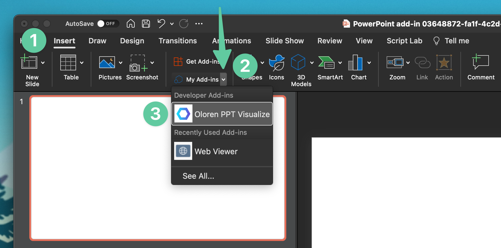

# PowerVis
Plugin to show visualizations on powerpoint.


## Installation on Mac
Paste the following command into your terminal:
```bash
mkdir -p /Users/$USER/Library/Containers/com.microsoft.Powerpoint/Data/Documents/wef && curl https://raw.githubusercontent.com/Oloren-AI/PowerVis/main/powervis.xml  > /Users/$USER/Library/Containers/com.microsoft.Powerpoint/Data/Documents/wef/oloren-ppt.xml
```

Then completely quit your powerpoint application and reopen it!

This command drops  [the add in's XML](powervis.xml) into your powerpoint add ins folder.


## How to Launch Plugin
Go to insert tab in powerpoint, click my add-ins, click Oloren PPT Visualize. Then, follow the instructions to paste a data URL to see a visualization.



## Usage Screnshots


## FAQ

**How can I modify a visualization?**
Just delete the visualization and add a new pane in its place.

**Can I create multiple visualizations in one slide?**
Yep, just use the insert menu twice.

**Can I install this on Windows/Linux?**
We don't have public support for this yet - but send us an email at support@oloren.ai if you want to get beta access.
