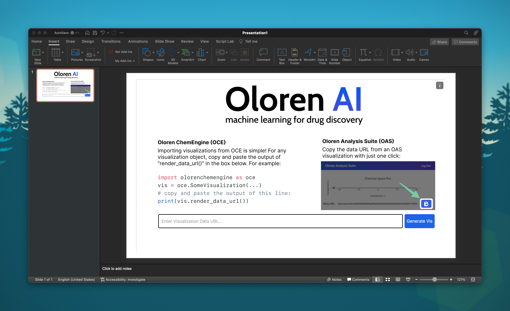

# PowerVis
Plugin to show visualizations on powerpoint.


## Installation on Mac
Paste the following command into your terminal:
```bash
mkdir -p /Users/$USER/Library/Containers/com.microsoft.Powerpoint/Data/Documents/wef && curl https://raw.githubusercontent.com/Oloren-AI/PowerVis/main/powervis.xml  > /Users/$USER/Library/Containers/com.microsoft.Powerpoint/Data/Documents/wef/oloren-ppt.xml
```

This command drops the add in's XML into your powerpoint add ins folder.


## Usage Screnshots



## Installation on Windows/Linux
Unfortunately, installation on thse platforms is not currently supported.